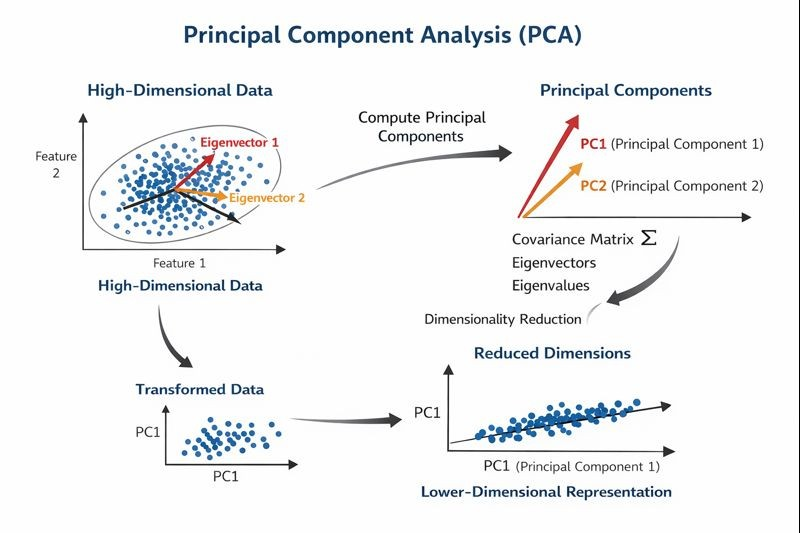

Principal Component Analysis (PCA) is a dimensionality reduction technique used in unsupervised learning to transform a dataset with many variables into a smaller set that still contains most of the essential information. PCA helps us get rid of non-important features. It helps in faster training and inference, and even data visualization becomes easier. High-dimensional data often includes correlated features, which increase computational complexity and make data interpretation difficult. PCA addresses this problem by transforming the original variables into a new set of uncorrelated variables, called principal components, while retaining as much of the original information as possible.

#### 1. Objective of PCA

The objective of PCA is to identify directions in the feature space along which the variance of the data is maximized. The diagram shows how a dataset with many correlated features is first represented in a high-dimensional space. PCA then identifies new axes called principal components that point in the directions of maximum data spread. The original data points are projected onto these new axes, resulting in a reduced-dimensional dataset that still preserves most of the important information.

#### 2. Mathematical Foundation

The mathematical foundation of PCA lies in linear algebra, specifically in eigenvectors and eigenvalues. Eigenvectors define the directions of maximum variance in the data, while eigenvalues indicate the amount of variance explained by each direction.

For a square matrix A, an eigenvector v and its corresponding eigenvalue λ satisfy the equation:

Av = λv

In PCA, eigenvectors and eigenvalues are derived from the covariance matrix of the data. Eigenvectors associated with larger eigenvalues correspond to more informative principal components. These eigenvectors are normalized to unit length before being used for projection.

#### 3. Dimensionality Reduction

By projecting the data onto a smaller number of important principal components, PCA reduces the number of features while keeping most of the useful information. Only the components that capture a large amount of variation in the data are selected. This way, PCA makes the dataset simpler and easier to work with without losing its essential patterns.

#### 4. Merits of Using PCA

- Makes large and complex data easier to handle by reducing the number of features
- Removes repeated or similar information from the dataset
- Helps models run faster and more efficiently

#### 5. Demerits of Using PCA

- New features created by PCA are hard to understand and explain
- Some useful information may be lost during reduction
- Does not work well when data has non-linear patterns